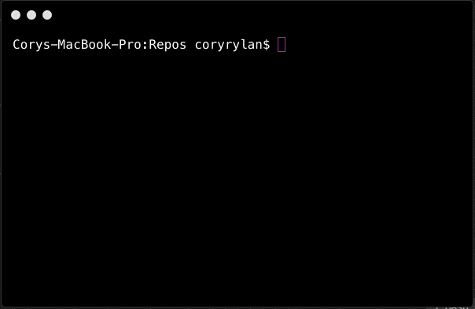

# Arbor
[](https://travis-ci.org/vintage-software/arbor)
[](https://badge.fury.io/js/arbor)

A CLI tool to build projects across several platforms in parallel.


Run `npm install -g arbor` to install. Create a `arbor.json` file with specified tasks.
Run `arbor run build` command, this will run the build task of all project recursively in the directory.
Ex: `cd repos && arbor run build` builds all of the repos/projects in `repos` directory.

- `npm install && npm start` to start project
- run `npm link` to link to global `arbor` see: [https://docs.npmjs.com/cli/link](https://docs.npmjs.com/cli/link)

## Example arbor.json
``` javascript
{
  "name": "My Node Project",
  "tasks": {
    "build": "npm run build",
    "test": "npm run test"
  }
}
```

``` javascript
{
  "name": "My .NET Project",
  "tasks": {
    "build": "msbuild",
  }
}
```

### Multiple projects per configuration

``` javascript
[
  {
    "name": "product api",
    "tasks": {
      "build": "msbuild /v:q",
      "build--prod": "msbuild /p:configuration=release /v:q"
    }
  },
  {
    "name": "product website",
    "tasks": {
      "build": [
        { "status": "installing", "command": "npm install", "cwd": "./web" },
        { "status": "building", "command": "npm run build", "cwd": "./web" }
      ],
      "build--prod": [
        { "status": "installing", "command": "npm install", "cwd": "./web" },
        { "status": "building", "command": "npm run build--prod", "cwd": "./web" }
      ]
    }
  }
]
```

